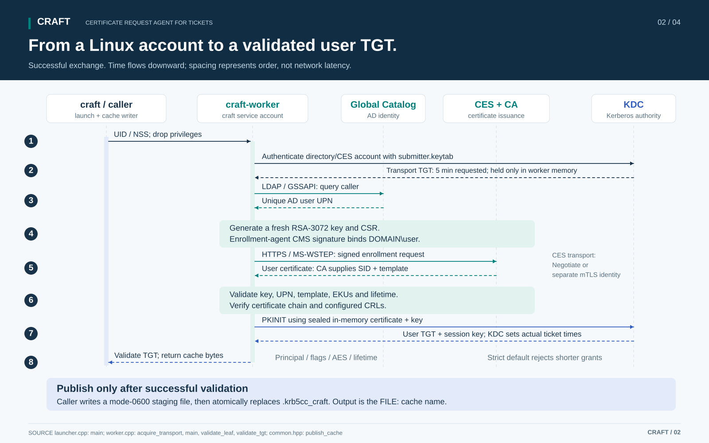
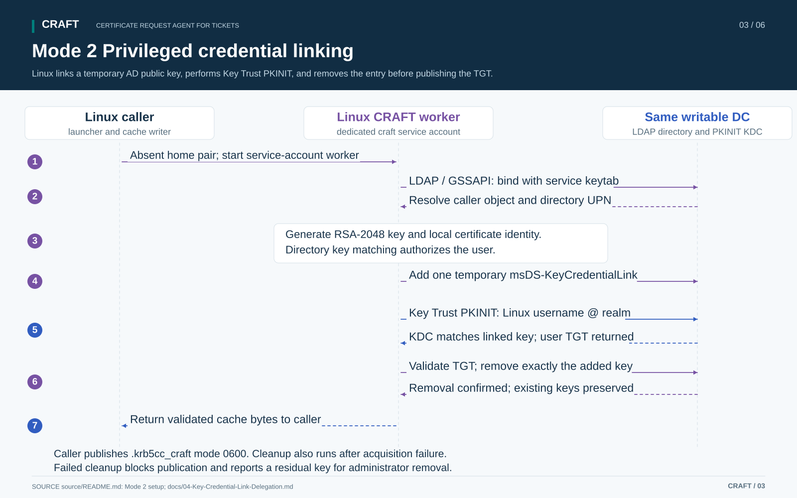
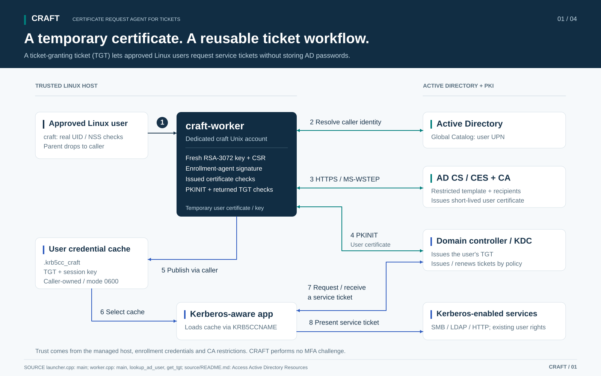

# CRAFT deployment overview

CRAFT obtains a user's Kerberos TGT through PKINIT from Linux. Choose one of three operating modes: Linux orchestrates privileged certificate enrollment, Linux orchestrates privileged credential linking, or Linux uses a certificate and private key exported from Windows with an entirely unprivileged acquisition path. A Linux host can operate without joining the AD domain.

## Choose a mode and follow its setup

| Mode | Required authority and infrastructure | Setup |
| --- | --- | --- |
| **1. Linux privileged certificate enrollment** | Dedicated Linux service account, setuid launcher, AD directory keytab, enrollment-agent certificate, restricted AD CS template and CES endpoint | [Mode 1 setup](source/README.md#mode-1-setup-privileged-certificate-enrollment), then [CA recipient restrictions](docs/03-Enrollment-Agent-Restrictions.md) |
| **2. Linux privileged credential linking (Key Trust)** | Dedicated Linux service account, setuid launcher, AD directory keytab, scoped `msDS-KeyCredentialLink` access and writable PKINIT-capable DC | [Mode 2 setup](source/README.md#mode-2-setup-privileged-credential-linking), then [directory delegation](docs/04-Key-Credential-Link-Delegation.md) |
| **3. Linux unprivileged Windows-exported certificate** | Windows user enrollment with an exportable software key; PEM certificate/key securely transferred to the Linux user's home | [Mode 3 setup](source/README.md#mode-3-setup-unprivileged-windows-exported-certificate), including [Windows export](source/README.md#request-a-home-certificate-on-windows) |

All modes need administrator-controlled Linux Kerberos configuration, KDC trust and current CRLs. Modes 1 and 3 also validate the user certificate against configured CA trust and CRLs. Mode 2 authenticates the user through the linked public key; it still validates the KDC certificate.

## Mode 1 flow



The service account uses its directory keytab for LDAP/GSSAPI and, with `ces_auth=negotiate`, CES HTTP authentication. The enrollment-agent key signs the EOBO request; a separate mTLS identity can authenticate CES transport instead. The CA must enforce the allowed agent, template and recipient scope. Generated user credentials remain temporary on Linux, while CA records persist.

## Mode 2 flow



Set `mechanism=key_trust` and point `kt_dc_url` at the same writable DC configured as the KDC. The delegated attribute write permits authentication as each target in scope. Keep privileged accounts outside that scope. CRAFT preserves existing key credentials and requires successful removal of its temporary entry before publishing the cache. Administrator cleanup may be needed if the directory remains unavailable.

## Mode 3 flow


Run the Windows certificate helper as the intended domain user without elevation. Transfer `user.pem` and its matching unencrypted `user.key` to `~/.config/craft/`. Install Linux executables without setuid. CRAFT leaves the supplied files in place; repeat Windows enrollment/export and transfer replacements before expiry. This mode needs no Linux service account, directory keytab, LDAP lookup, CES or runtime issuance directory.

## How CRAFT selects the mode



A complete `~/.config/craft/user.pem` and `user.key` pair selects mode 3's acquisition path, even on a privileged installation. CRAFT reads them using the caller's permissions. Partial, unsafe or invalid files fail and retain the current cache. When both files are absent, `mechanism=enrollment` selects mode 1 and `mechanism=key_trust` selects mode 2. An ordinary installation reports that privileged acquisition is unavailable without a pair. Neither privileged mechanism falls back to the other.

“Privileged mode” requires an installed setuid launcher; it does not mean users run `sudo craft`. Users always invoke the no-argument entry point as themselves. Network and certificate work runs under the caller or the dedicated service account, and cache publication runs as the caller.

## Components and paths

| Component | Path or value | Modes |
| --- | --- | --- |
| Launcher, worker, optional maintainer | `/usr/local/bin/craft`, `/usr/local/libexec/craft-worker`, `/usr/local/bin/craft-maintain` | All |
| Public configuration and trust | `/etc/craft/`, root-controlled and readable by callers | All |
| Supplied certificate and key | NSS home `~/.config/craft/user.pem` and `user.key` | 3; also takes priority on installations for 1 or 2 |
| Service account and private runtime | `craft:craft`, `/run/craft/` mode 0700 | 1 and 2 |
| Approved caller group | `craft-users`; service credentials remain inaccessible to it | 1 and 2 |
| Credential cache | NSS home `.krb5cc_craft`, caller-owned mode 0600 | All |
| Optional command wrapper | `with-craft` | All |

## Build and begin validation

Install the [Linux dependencies](source/README.md#build), then run from the repository root:

```sh
cmake -S source -B build -DCMAKE_BUILD_TYPE=Release
cmake --build build -j2
ctest --test-dir build --output-on-failure
```

Follow the setup link for your selected mode. Each recipe starts with the [shared Linux installation](source/README.md#shared-linux-installation); modes 1 and 2 add the [privileged installation](source/README.md#shared-privileged-installation). Replace placeholders and keep acquisition disabled until configuration is ready. Complete the corresponding [acceptance checks](source/TESTING.md).

All paths request `<Linux username>@<configured realm>` and check the returned TGT. Applications use `KRB5CCNAME` to select the cache and obtain service tickets; service access follows the user's permissions. Defaults request a ten-hour initial TGT, seven-day renewal and AES256/AES128 encryption, subject to KDC policy and certificate/key lifetime. Strict mode rejects shortened grants; `require_full_tgt_lifetime=no` accepts them with a warning.

For long-running jobs, [configure `craft-maintain`](source/README.md#long-running-jobs). Renewal uses only the cache. Fresh authentication uses the same mode selection and requires a valid supplied certificate or authorized privileged mechanism. Ending maintenance, removing a linked key or deleting a certificate does not revoke an issued ticket.

The [process guide](docs/01-CRAFT-Process-Overview.docx) ([PDF](docs/01-CRAFT-Process-Overview.pdf)) covers all three flows and the credential lifecycle. The [configuration guide](docs/02-CRAFT-Configuration-and-Validation.docx) ([PDF](docs/02-CRAFT-Configuration-and-Validation.pdf)) compares their requirements and validation. See the [security review](source/SECURITY.md) for trust boundaries and the [diagram collection](output/pdf/CRAFT-Timing-and-Architecture.pdf) for downloadable figures.

CRAFT is a reference implementation. It does not perform an MFA challenge or prove completion of interactive MFA. No real keys, certificates, keytabs or tickets are bundled.

## License

Source code, scripts, configuration examples and documentation are licensed under [GNU GPL version 3 only](LICENSE) (`GPL-3.0-only`).
