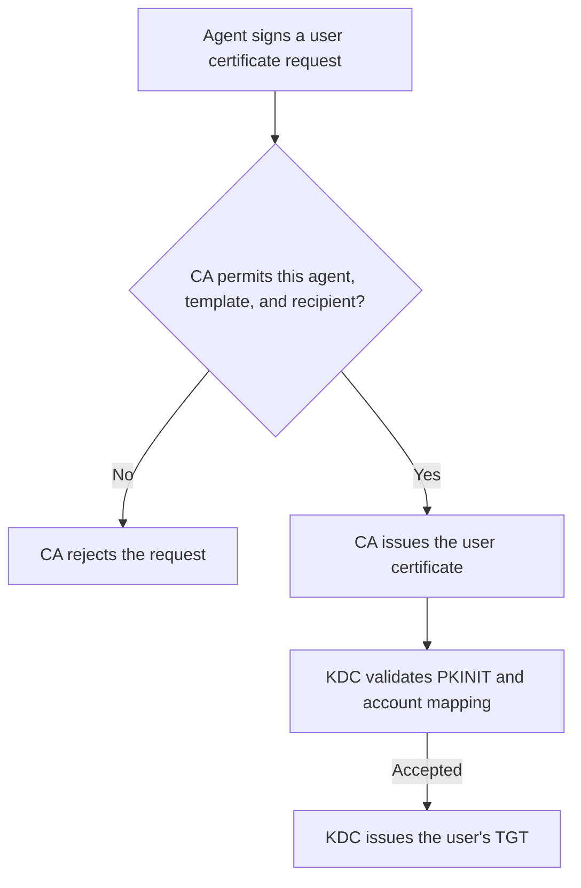

# CRAFT Enrollment Agent Restrictions

An enrollment-agent private key delegates the ability to obtain certificates for other people. For CRAFT, the decisive safeguard is an explicit CA policy that permits a particular agent to use a particular user-certificate template for a small, approved set of accounts. Keep privileged identities outside that set, and protect the administrators and directory objects that define it.

The certificate's Certificate Request Agent usage identifies its purpose. It does not encode a list of users the agent may impersonate. Microsoft describes enrollment-agent certificates as especially powerful because enrollment on behalf of another subject can bypass an organization's normal authentication policy. [Microsoft certificate-template access-control guidance](https://learn.microsoft.com/en-us/openspecs/windows_protocols/ms-crtd/0e7974b3-1550-4b50-808d-2274b0ce11ab).

This page explains the authorization boundary, a recommended CRAFT configuration, the remaining risks, and the live tests needed to establish that privileged accounts cannot be enrolled. The configuration examples are recommendations, not a claim that those controls are already deployed in your domain.

## What the agent can do

CRAFT generates a user key and CSR, then signs an enrollment-on-behalf-of request with the agent key. Its signed `requestername` identifies `DOMAIN\user`. The signing certificate has Certificate Request Agent EKU `1.3.6.1.4.1.311.20.2.1`; the CA issues the final user certificate. [Microsoft EOBO processing rules](https://learn.microsoft.com/en-us/openspecs/windows_protocols/ms-wcce/a1f97d5d-4653-48c1-b483-e8adbb7a123f).

The dangerous outcome is an attacker obtaining a legitimate certificate for a privileged account and using it for PKINIT. The KDC then issues a real TGT for that account. The enrollment-agent key does not give CRAFT the CA's signing key or the domain's `krbtgt` key; it supplies an authorization signature on a request. PKINIT authenticates a client to the KDC using a certificate and proof of possession of its private key. [RFC 4556](https://www.rfc-editor.org/rfc/rfc4556).



The design implication is to stop unauthorized issuance at the CA. Once a certificate for a domain administrator has been legitimately issued and maps correctly, strong mapping can confirm the administrator's identity rather than stop the impersonation.

Keep three identities distinct when reviewing a request:

| Identity | Role in CRAFT | Relevant control |
| --- | --- | --- |
| Enrollment agent | The AD identity represented by `agent.pem`, whose key signs the EOBO request | Agent-certificate issuance permissions and CA enrollment-agent restrictions |
| Submission and directory account | `service_principal` and `submitter.keytab`; authenticates directory lookups and the Negotiate CES connection | Directory access, transport authentication, CA/template permissions, and CES delegation configuration |
| Recipient | The calling user's AD account named in the signed request | CA recipient restrictions, directory identity construction, and KDC certificate mapping |

The [provisioning helper](../scripts/Configure-CRAFT-CA.ps1) uses the same named AD account for the first two roles. They can be provisioned separately, and mTLS adds a separate HTTPS client credential. Changing how a connection authenticates does not redefine the permitted certificate recipients.

## Configure an explicit CA authorization rule

Use a rule with all three dimensions restricted. For example:

| Enrollment agent | Permitted user template | Permitted recipients |
| --- | --- | --- |
| `DOMAIN\svc-linux-enroll` | `CRAFTUser` | Members of `DOMAIN\CRAFT Approved Users` |

Microsoft's EOBO specification requires a CA implementing enrollment-agent restrictions to check the agent's permission for the specific subject and template and return an error when that permission is absent. [Microsoft CA authorization rules](https://learn.microsoft.com/en-us/openspecs/windows_protocols/ms-wcce/6becda04-e17f-46df-825a-cec64ed0a203).

On the issuing CA:

1. Open **Certification Authority** (`certsrv.msc`), open the CA's **Properties**, and select **Enrollment Agents**.
2. Select **Restrict enrollment agents**.
3. Remove any broad grant that applies to the CRAFT signer, including grants through groups such as Everyone or Authenticated Users.
4. Add the actual AD signing identity, select only `CRAFTUser`, and authorize only `CRAFT Approved Users` as recipients.
5. Review the complete rule set for overlapping grants. A narrow entry does not neutralize a broader applicable grant.
6. Apply the configuration and verify it with successful and denied requests.

The default policy and the initial rules shown when restrictions are enabled can be permissive. Selecting the restriction option alone is insufficient: inspect the agent, template, and recipient entries. [SpecterOps enrollment-agent restriction analysis, pages 66–67](https://specterops.io/wp-content/uploads/sites/3/2022/06/Certified_Pre-Owned.pdf#page=68).

These permissions belong to the CA. They do not travel with the agent certificate to another CA. Audit every issuing CA that could accept the signing credential, including alternate or recovery CAs, and test every exposed submission path. Restrict network access to the enrollment services required by the deployment, while retaining the CA authorization checks.

Restrictions identify principals using SIDs and include template and recipient information in the CA's access-rights descriptor. Match the rule to the signing identity, not the certificate's friendly name, requested CN, or the administrator who exported the PFX. [Microsoft enrollment-agent access-rights format](https://learn.microsoft.com/en-us/openspecs/windows_protocols/ms-csra/978e78f7-92ba-4295-b12e-e7e8c253731e).

**Design recommendation:** use separate agent AD accounts and separate keys for hosts or workloads that need different recipient sets. Two certificates issued to the same agent account do not, by themselves, create separate recipient policies. Shared agent credentials expand the impact of compromise to the entire shared authorization scope.

## Make the recipient group a security boundary

Membership in `CRAFT Approved Users` means that the CRAFT host is trusted to authenticate as that account through certificate enrollment. It is an authorization decision, even when the account also uses MFA for interactive sign-in.

Recommended membership policy:

- Admit only the ordinary user or workload accounts required for this deployment. Prefer direct membership and avoid nesting broad access groups.
- Exclude separate administrative identities, Domain Admins, Enterprise Admins, domain controllers, PKI administrators, and accounts with directory-replication rights.
- Also exclude identities that control privileged groups, reset privileged passwords, administer identity infrastructure, manage its backups, or control systems that can alter the CA or domain controllers.
- Review application and infrastructure privileges. A user outside Domain Admins can still administer a critical database, virtualization platform, software-deployment service, or secrets store.
- Keep the agent and transport accounts out of privileged roles and out of the recipient set unless a separately reviewed workflow requires their enrollment.

A list of privileged group names cannot capture every route to privilege. Review nested membership, delegated AD permissions, SID history, ownership and ACLs, and the account's effective access to critical systems. `adminCount=1` can be a useful review signal, but it is not a complete or current classification of privilege.

The following read-only inventory is a starting point for reviewing explicit group membership:

```powershell
Import-Module ActiveDirectory
$recipientGroup = Get-ADGroup -Identity 'CRAFT Approved Users'

Get-ADGroupMember -Identity $recipientGroup |
    Select-Object Name, SamAccountName, ObjectClass, DistinguishedName

Get-ADGroupMember -Identity $recipientGroup -Recursive |
    Where-Object ObjectClass -eq 'user' |
    ForEach-Object {
        Get-ADUser -Identity $_.DistinguishedName -Properties Enabled, adminCount, sIDHistory
    } |
    Select-Object SamAccountName, Enabled, adminCount, sIDHistory
```

Treat this as an inventory, not a proof of safe effective membership. Review primary-group membership, cross-domain relationships, nested-group administration, and delegated permissions separately. Investigate unexpected non-user members in the direct inventory.

Protect the group's owner and ACL so recipients, CRAFT service identities, host administrators, and ordinary help-desk accounts cannot admit new targets. Record the business owner, admission criteria, and approval process. Alert on membership and ACL changes, and reassess recipients whenever their privileges change.

If an approved account later becomes a domain administrator, the existing recipient rule can become authorization to impersonate a domain administrator. Remove it from the recipient group before granting privileged access, and account for certificates and tickets already issued. Prefer a separate administrative account that never participates in CRAFT enrollment.

Explicit Deny rules for a carefully maintained privileged-account group can provide another control, but they must be tested with overlapping and nested memberships. Keep the positive recipient allowlist small; a blacklist alone requires discovering every existing and future privileged identity.

## Control both certificate templates

The agent certificate and the issued user certificate serve different purposes. Secure their issuance and administration separately.

### Enrollment-agent certificate template

Permit enrollment only to the designated agent identities and tightly controlled provisioning administrators. Retain Certificate Request Agent as the intended application policy, and review any additional EKUs. Avoid Any Purpose, absent usage restrictions, or unnecessary client-authentication and certificate-signing capabilities. A software signing key that can also authenticate to other services has a larger scope of use.

Protect the template owner, write permissions, and ACL administration. Review any other published template through which an agent or an ordinary account could obtain another enrollment-agent certificate. Microsoft identifies overly broad enrollment rights on agent templates and absent CA restrictions as enrollment-agent abuse risks. [Microsoft ESC3 security assessment](https://learn.microsoft.com/en-us/defender-for-identity/security-posture-assessments/certificates#edit-misconfigured-enrollment-agent-certificate-template-esc3).

For an infrequently provisioned agent credential, consider certificate-manager approval and publishing its issuance template only during controlled provisioning or renewal. These are recommended operational choices: acquiring the initial agent credential need not be as automatic as ordinary user enrollment. Unpublishing a template prevents new requests through that template; it does not revoke existing agent certificates. Microsoft recommends limiting publication of infrequently used high-value templates. [Microsoft PKI technical controls](https://learn.microsoft.com/en-us/previous-versions/windows/it-pro/windows-server-2012-r2-and-2012/dn786426(v=ws.11)#securing-certificate-templates).

### CRAFT user-certificate template

Use the dedicated `CRAFTUser` template with the settings described in the [installation guide](../source/README.md#enrollment-agent-and-dedicated-template):

- A configurable template with **one authorized signature**, requiring the **Certificate Request Agent** application policy.
- Subject and UPN constructed from AD for the signed requester identity; retain the CA-generated SID security extension.
- Explicit `CA:FALSE`, digital-signature key usage, and no certificate- or CRL-signing authority.
- Smart Card Logon, Client Authentication, and PKINIT Client Authentication EKUs, as required by CRAFT's certificate validator.
- Narrow enrollment permissions, protected template administration, and a CA-enforced short validity period.

The signature requirement proves that a qualifying signing credential approved the request. The CA recipient rule determines whom that signer may represent. Both controls are required. Microsoft specifies enforcement of the configured signature count and signing-certificate policies. [Microsoft authorized-signature processing](https://learn.microsoft.com/en-us/openspecs/windows_protocols/ms-wcce/35e6361f-8d69-4fbe-a586-5f1c8395ffcd).

Template enrollment ACLs are another gate. Give the submission path only its required enrollment rights and verify the effective identity used by CES and the CA. An Enroll grant to the agent is not a recipient allowlist: EOBO deliberately requests a certificate for someone else. [Microsoft template-permission checks](https://learn.microsoft.com/en-us/openspecs/windows_protocols/ms-wcce/7023778f-e2c8-4ab2-a106-8a4467cf13ed).

Review other published user-authentication templates, especially legacy templates with different EOBO behavior. A well-configured `CRAFTUser` template does not compensate for another template or CA through which the same credential can obtain privileged authentication certificates.

### Approval and renewal settings

Manager approval can add human review, but the current CRAFT flow requires an immediately issued certificate and rejects pending enrollment responses. Requiring multiple authorized signatures also requires a different workflow: CRAFT supplies one agent signature. If privileged enrollment needs independent approval or multiple parties, use a separately designed enrollment process rather than admitting privileged accounts to the automatic CRAFT recipient group.

Inspect renewal policy as well as initial issuance. Certain previous-approval reenrollment flags can relax signature and manager-approval requirements when their renewal conditions are satisfied. CRAFT performs fresh user-certificate enrollment, but a stolen issued certificate might be used through another renewal path. Decide whether renewal is permitted and test the effective restrictions rather than assuming initial-issuance controls cover it. [Microsoft enrollment and reenrollment flags](https://learn.microsoft.com/en-us/openspecs/windows_protocols/ms-wcce/9cc7ba15-fcbc-48b3-8a3b-121faef3d5ef).

## Keep identity construction and mapping strict

For an AD-built subject template, the CA derives the subject and UPN from directory information. With the security extension enabled, it also supplies the AD object's SID. Keep **Supply in the request** disabled for the CRAFT user template; changing the CSR's CN or UPN must not authorize a different account. [Microsoft subject and SID construction rules](https://learn.microsoft.com/en-us/openspecs/windows_protocols/ms-wcce/a1f27ffb-7f74-4fa1-8841-7cde4ba0bcfe).

Keep DCs in strong certificate-mapping enforcement and review alternate explicit certificate mappings, including who can write `altSecurityIdentities` on sensitive accounts. Microsoft documents the distinction between strong mappings and mappings based only on reusable names. [Microsoft certificate-mapping guidance](https://support.microsoft.com/en-us/topic/kb5014754-certificate-based-authentication-changes-on-windows-domain-controllers-ad2c23b0-15d8-4340-a468-4d4f3b188f16).

**Authorization example:** if a CA permits the agent to enroll `DOMAIN\admin`, it can issue a certificate containing that administrator's correct UPN and SID. The KDC can then validate a correct mapping and authenticate the administrator. Mapping protects the relationship between a certificate and an account; the recipient rule protects the decision to issue that account's certificate.

Review CA-wide identity overrides too. In particular, `EDITF_ATTRIBUTESUBJECTALTNAME2` permits requester-supplied SAN attributes even for templates with AD-built subjects. Keep that override disabled for this design. Microsoft cautions against enabling it on an enterprise CA. [Microsoft SAN attribute guidance](https://learn.microsoft.com/en-us/previous-versions/windows/it-pro/windows-server-2012-r2-and-2012/dn786426(v=ws.11)#controlling-user-added-subject-alternative-names).

Protect the directory attributes used for identity selection and any explicit mappings. Keep certificate issuance policies free of unintended privilege grants. Authentication Mechanism Assurance can map issuance-policy OIDs to security groups or claims; consequently, an ordinary recipient can gain additional authorization through certificate policy. Review `msPKI-Certificate-Policy` and any associated `msDS-OIDToGroupLink` relationships. [Microsoft issuance-policy authorization guidance](https://learn.microsoft.com/en-us/windows/security/identity-protection/credential-guard/additional-mitigations#how-a-certificate-issuance-policy-can-be-used-for-access-control).

Apply supported security updates to CAs, CES hosts, and DCs. Configuration controls must be evaluated against a patched implementation. Microsoft documents certificate-application-policy vulnerabilities that can undermine expected template restrictions. [Microsoft arbitrary application-policy assessment](https://learn.microsoft.com/en-us/defender-for-identity/security-posture-assessments/certificates#prevent-certificate-enrollment-with-arbitrary-application-policies-esc15).

## Protect the key and the policy administrators

The [CRAFT security notes](../source/SECURITY.md) describe the local boundary: the worker runs as a dedicated Unix service account, reads the administrator-provisioned agent key, and uses root-controlled configuration. Restrict the `craft` service group to that account. The separate `craft-users` group controls launcher execution; ordinary users must not be able to run arbitrary commands as the service account or read its enrollment credentials.

Assume compromise of root or of the worker's service account exposes the software agent key or permits its misuse. CRAFT's checks on the calling UID, directory UPN, certificate, and returned ticket reduce mistakes and local abuse through the supported launcher. An attacker using the key through a different client can bypass those checks, so the CA must enforce the recipient boundary independently.

Recommended key-custody practices include unique credentials for distinct authorization scopes, protected deployment channels, restricted backup access, deliberate certificate renewal and key rotation, and prompt removal of export copies. A PFX password protects the export; it does not provide an interactive second factor for an unattended process that can read the operational key.

Hardware key storage or a separately protected signing service can reduce key extraction. These require integration work: the current CRAFT worker loads `agent.key` as a software key and has no hardware-key backend. A compromised host that can invoke an authorized signer may still misuse it within its permitted scope. A signing service should validate the recipient and template itself and retain the CA restrictions.

Protect the administrators who can change that scope. The CRAFT agent and transport accounts must not have CA administration, certificate-manager approval, template ownership/write access, recipient-group administration, or administrative access to PKI servers. CA administrator and officer permissions control security and configuration changes and approval operations. [Microsoft CA permission model](https://learn.microsoft.com/en-us/openspecs/windows_protocols/ms-csra/509360cf-9797-491e-9dd1-795f63cb1538).

**Residual-risk boundary:** an attacker who controls the CA, its signing key, or the administrators who can rewrite its policy can defeat enrollment-agent restrictions. Treat the issuing CA and its management systems as part of the privileged identity infrastructure.

## Secure every enrollment path

CRAFT uses CES over verified HTTPS. Keep the transport and CES-to-CA delegation configuration narrow, expose only required endpoints, and review direct CA enrollment interfaces and other web enrollment services. Hiding a template in one client UI does not prevent a different client from submitting it.

For Windows-authenticated enrollment endpoints, apply Microsoft's protections against NTLM relay, including HTTPS and Extended Protection for Authentication, and disable NTLM where the deployment permits it. Validate the selected CES authentication mode after hardening. [Microsoft AD CS relay mitigation guidance](https://support.microsoft.com/en-us/topic/kb5005413-mitigating-ntlm-relay-attacks-on-active-directory-certificate-services-ad-cs-3612b773-4043-4aa9-b23d-b87910cd3429).

An agent signature and a transport credential answer different questions. Preserve both gates, while ensuring the CA still rejects an unauthorized recipient when the transport credentials, request format, and signature are otherwise valid.

## Understand the limits of other protections

| Protection | Useful effect | Limit for enrollment-agent abuse |
| --- | --- | --- |
| Correct CA-generated SID and strong mapping | Binds the issued certificate to an AD account | A correctly issued certificate for an unauthorized privileged recipient can still map successfully |
| Agent signature requirement | Requires a qualifying signer | A stolen or misused authorized signer still needs recipient restrictions |
| Ordinary interactive MFA | Protects the sign-in paths that enforce it | CRAFT's software-key PKINIT path does not perform that MFA challenge |
| Short user-certificate validity | Reduces the period for new authentication using that certificate | Does not remove already issued tickets or stop new enrollment using a still-authorized agent |
| Non-forwardable and non-proxiable user TGT | Limits ticket delegation | Does not restrict ordinary service-ticket use to an approved list of services |
| AES-only Kerberos | Protects the chosen encryption profile | Does not decide which identity the agent may enroll |
| Protected Users and authentication policies | Add protocol, device, delegation, and lifetime constraints where enforced | Must be evaluated separately from CA enrollment authorization |
| CRAFT's local validation | Checks the supported client's inputs and results | Can be bypassed by an attacker using another client with the credentials |

The ticket distinction follows Kerberos's service-ticket and forwarding mechanisms: a client normally uses a TGT to obtain service tickets, while forwarding concerns transferring credentials for use elsewhere. [RFC 4120](https://www.rfc-editor.org/rfc/rfc4120).

Protected Users imposes additional restrictions, including shorter, nonrenewable TGT behavior under the documented domain prerequisites. That can make the account incompatible with CRAFT's requested lifetime and renewal policy. It does not establish a CA recipient allowlist. **Design implication:** do not count a failure of CRAFT's strict lifetime check as proof that another client cannot authenticate using an issued privileged certificate. [Microsoft Protected Users guidance](https://learn.microsoft.com/en-us/windows-server/security/credentials-protection-and-management/protected-users-security-group).

CRAFT's defaults request a ten-hour initial TGT and a seven-day renewal window. An already issued renewable TGT can remain useful after the certificate expires, subject to KDC policy. The maintainer can also obtain fresh credentials for a running job while enrollment remains authorized. Select certificate, ticket, and renewal lifetimes together; the [credential-lifecycle guide](../source/README.md#separate-certificate-and-tgt-lifetimes) describes the separate controls.

## What the provisioning helper verifies

[`Configure-CRAFT-CA.ps1`](../scripts/Configure-CRAFT-CA.ps1) is a partial lab-provisioning helper. Its `AllowedTargetGroup` parameter names an existing security group. Before publication or credential export, its policy checks require an explicit rule naming the configured agent, CRAFT template, and that recipient group. It also checks the agent's transitive authorization groups and SID history for applicable broad grants, and checks template enrollment/write permissions.

That verification does not establish that every group member is nonprivileged, validate all other CAs or enrollment paths, implement CES hardening, or continuously monitor policy drift. The helper's selected group remains an administrative trust decision. Use the helper as one check within the deployment review, and perform the live tests below before enabling CRAFT.

The worker's fixed template and directory-resolved UPN checks are also separate from CA policy. The CA constructs the issued account identity and the DC enforces mapping. A successful local certificate-validation test does not prove that the agent is unable to enroll a different target through another client.

## Prove denial at the CA

Use an isolated lab and disposable identities. Test requests using the enrollment-agent credential directly through the enrollment interfaces under review, in addition to the ordinary CRAFT path. Make prohibited requests otherwise valid: correct transport authentication, trusted and unexpired signer, correct signature, and a valid CSR. A failure caused by malformed XML, an expired credential, or a Linux UID check does not establish recipient authorization.

| Test case | Required observation |
| --- | --- |
| Approved ordinary recipient, authorized agent, `CRAFTUser` | CA issues the expected certificate; PKINIT authenticates the intended ordinary account |
| Ordinary account outside the recipient group | CA rejects issuance despite a valid agent signature and transport authentication |
| Disposable privileged account outside the group | CA rejects issuance; include identities with nested privileged membership and delegated privileges |
| Approved recipient, different published authentication template | CA rejects unauthorized use of that template |
| Different signer with Certificate Request Agent EKU but no applicable permission | CA rejects the request |
| Missing qualifying agent signature | CA rejects the request under the user-template issuance requirements |
| Allowed requester with a different account's identity supplied in the CSR | CA constructs identity from the authorized AD requester or rejects; no certificate usable as the other account is issued |
| Recipient removed from the group | Fresh issuance is denied after relevant replication and policy/cache propagation; evaluate existing credentials separately |
| Disabled or revoked signing credential, or withdrawn agent authorization | Validate the chosen disable mechanism at the CA; fresh prohibited issuance must stop |
| Alternate reachable CA or enrollment interface | No route issues a prohibited recipient/template combination |
| Certificate renewal using an issued user certificate | The allowed renewal policy is enforced and does not supply an unintended continuing authentication path |

Also test misconfiguration detection in the lab: an applicable broad group grant must fail the configuration review, and a privileged account admitted to the recipient group must be detected by membership governance. Native restrictions authorize the configured recipient set; they do not automatically subtract every account with privileged effective access.

Record the CA request ID, disposition and policy error, signer identity, selected template, intended recipient, and applicable CA rules. For successful control requests, inspect the issued UPN, SID, template, usages, validity, and resulting KDC principal. Never obtain production privileged credentials merely to demonstrate a negative case.

Use the [live acceptance checklist](../source/TESTING.md#live-acceptance-checklist) for the wider CRAFT deployment. Offline helper and cryptographic tests do not establish the effective policy of a live CA.

## Audit and respond to compromise

Enable the operating system's **Audit Certification Services** policy and the corresponding CA audit categories. Centralize issuance, denial, revocation, policy-change, template-change, and recipient-group-change records so a compromised enrollment host cannot remove the only evidence.

Useful CA events include 4886 for requests received, 4887 for issued certificates, 4888 for denied requests, 4870 for revocation, and 4882/4885/4891 for security, audit-filter, and configuration changes. [Microsoft certification-services audit events](https://learn.microsoft.com/en-us/previous-versions/windows/it-pro/windows-10/security/threat-protection/auditing/audit-certification-services).

Correlate CA issuance with DC event 4768 for certificate-based TGT requests. Where populated, its certificate issuer, serial number, and thumbprint help connect authentication to issuance. [Microsoft TGT audit-event fields](https://learn.microsoft.com/en-us/windows/security/threat-protection/auditing/event-4768). Review strong-mapping failures alongside successful authentications; an attack that obtains a properly mapped certificate need not produce a mapping failure.

Alert on unexpected recipients, privileged recipients, unauthorized templates or signers, unusual volume or source hosts, new agent-certificate issuance, and changes to the allowlist or its administrators. Do not assume a CA log's single requester field captures the transport account, signing agent, and recipient separately. Establish which evidence identifies each role in the deployed CES/CA path; retain request or signer metadata where the standard logs are insufficient. Keep private keys, PFX passwords, and ticket contents out of logs.

If an agent key or host is compromised:

1. Stop CRAFT issuance and maintenance on the affected host, and isolate it from enrollment services.
2. Withdraw the agent's effective CA authorization on every relevant CA. Revoke the affected agent certificate, publish updated revocation information, and verify that the CA actually rejects new requests.
3. Rotate the compromised software key and relevant transport credentials, including the keytab or mTLS credential. Repair the host and the cause of compromise before restoring authorization.
4. Identify certificates already issued through the compromised authority, including requests outside the expected template or recipients. Revoke affected user certificates and ensure relying systems receive current revocation information.
5. Investigate KDC authentication, service-ticket use, and downstream access. Handle already issued tickets and sessions through the incident-response process; certificate revocation and deleting a local cache do not guarantee their immediate termination.
6. Restore only reviewed agent/template/recipient rules and repeat positive and negative acceptance tests.

**Design implication:** revoking the agent certificate prevents its future authorized use once revocation is enforced; it does not automatically revoke the user certificates that the CA issued in response to its signatures. They are separate credentials signed by the CA. Changing an account password is likewise not a substitute for investigating and revoking certificate credentials.

## Deployment acceptance criteria

Accept the automatic CRAFT enrollment path only when its CA authorization names a specific signer, dedicated template, and reviewed nonprivileged recipient set; every reachable issuance path enforces that boundary; and the identities able to change the policy are protected separately from the enrollment host. Require observed CA denial for prohibited recipients and templates, with sufficient audit evidence to explain the decision.

For accounts that administer the domain or its identity infrastructure, use a separate, explicitly reviewed authentication and enrollment workflow. The practical security claim for CRAFT should be that compromise exposes the approved ordinary recipient set, while privileged identities remain outside the agent's issuance authority.
