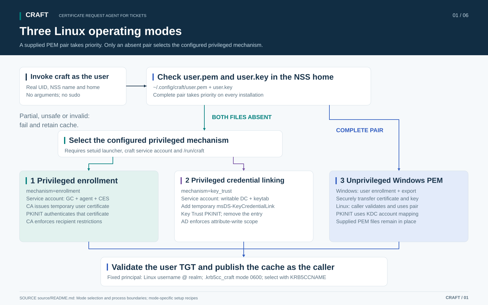
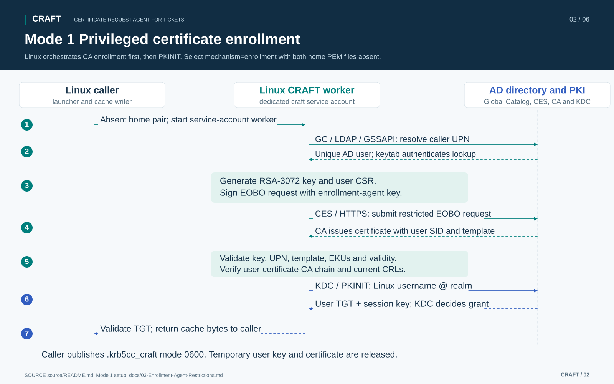
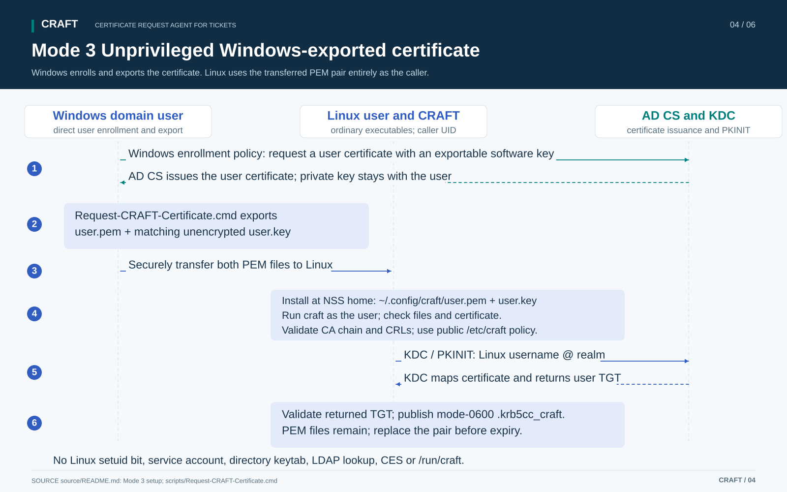

# CRAFT build configuration and setup

CRAFT obtains a user's Kerberos ticket-granting ticket (TGT) through PKINIT from Linux, including hosts that are not domain-joined. This guide covers **three operating modes**, their setup and their shared ticket-cache behavior. All modes support unattended applications without storing the user's AD password. CRAFT does not perform an MFA challenge or establish completion of interactive MFA.

| Mode | Linux acquisition identity | Credential source | Setup |
| --- | --- | --- | --- |
| **1. Privileged certificate enrollment** | Dedicated `craft` service account through the setuid launcher | AD CS certificate enrolled through CES with an enrollment-agent signature | [Mode 1 setup](#mode-1-setup-privileged-certificate-enrollment) |
| **2. Privileged credential linking (Key Trust)** | Dedicated `craft` service account through the setuid launcher | Temporary public-key entry in the user's `msDS-KeyCredentialLink` | [Mode 2 setup](#mode-2-setup-privileged-credential-linking) |
| **3. Unprivileged Windows-exported certificate** | Invoking Linux user through ordinary executables | Certificate and unencrypted private key exported on Windows and transferred to the user's Linux home | [Mode 3 setup](#mode-3-setup-unprivileged-windows-exported-certificate) |

The executables use C++20. Defaults request a ten-hour TGT, seven-day renewal and AES256/AES128 encryption. This is a reference implementation: complete the [acceptance checks](TESTING.md) for the installed mode and review the [security boundary](SECURITY.md).

## Mode selection and process boundaries

Invoke `/usr/local/bin/craft` with no arguments as the intended non-root user, without `sudo`. The launcher uses the real UID, NSS username and home, ignoring `$USER`, `$HOME`, `SUDO_USER`, `XDG_CONFIG_HOME` and caller-supplied Kerberos configuration.

1. The caller worker opens the fixed NSS-home `~/.config/craft/user.pem` and `user.key` pair using the caller's permissions.
2. A complete pair selects the unprivileged certificate path, even on a setuid installation. Partial, unsafe or invalid inputs fail; neither privileged mechanism is attempted.
3. Only an entirely absent pair selects `mechanism=enrollment` (mode 1, the default) or `mechanism=key_trust` (mode 2). Both require the setuid launcher, dedicated service account and private `/run/craft`. An ordinary installation fails when no pair is present. A failed privileged mechanism never selects the other one.
4. MIT Kerberos performs PKINIT for `<Linux username>@<configured realm>` using sealed certificate/key memory files. The KDC enforces account mapping. CRAFT checks the returned principal, TGT flags, AES encryption and lifetimes before the caller publishes the cache. [6,8]

“Privileged mode” describes installation authority. Certificate, LDAP, CES and Kerberos processing run as the dedicated service account rather than root; the cache writer permanently drops to the caller before reading credential bytes. Mode 3 runs acquisition as the caller and needs no setuid bit. The result is the user's TGT, not the service account's transport TGT.



## Mode 1 workflow: Privileged certificate enrollment

Linux resolves the caller's AD UPN through LDAP/GSSAPI, generates an RSA-3072 private key and CSR, signs an EOBO CMS request identifying `DOMAIN\linuxname` with the enrollment-agent key, and submits it through CES over verified HTTPS. The CA issues the short-lived user certificate under its template and recipient restrictions. CRAFT verifies the issued key, directory UPN, template, all three client EKUs, short validity, CA chain and CRLs, then performs PKINIT. [2,3,4,5]



Start with [mode 1 setup](#mode-1-setup-privileged-certificate-enrollment), [Windows enrollment preparation](#assumptions-and-windows-preparation) and [enrollment-agent restrictions](../docs/03-Enrollment-Agent-Restrictions.md). The generated user key and certificate are released after authentication; CA issuance records remain. The agent signature and CES transport authentication have separate roles.

## Mode 2 workflow: Privileged credential linking

Credential linking uses AD Key Trust, selected with `mechanism=key_trust`. Instead of requesting a CA-issued certificate, the dedicated service account writes a temporary public key to the caller's `msDS-KeyCredentialLink` and authenticates against it with Key Trust PKINIT — the key-based model Windows Hello for Business uses. It needs no user-certificate CA enrollment, CES, enrollment agent or user template. The KDC still needs a trusted PKINIT certificate and current CRLs.

When no home pair is present, the setuid launcher runs the worker as the service account exactly as for enrollment. The worker then:

1. Authenticates the service account from `submitter.keytab` and binds to `kt_dc_url` over LDAP with SASL/GSSAPI integrity and confidentiality.
2. Resolves the caller's unique object (`sAMAccountName=<caller>`) to its distinguished name and `userPrincipalName`.
3. Generates an RSA-2048 key (MS-ADTS 2.2.20.5.1 mandates RSA 2048-bit for KEY_USAGE_NGC) and a short-lived local certificate identity carrying that UPN. A temporary local issuer signs the leaf for the PKINIT plugin; directory key matching authorizes the user.
4. Builds a version-2 Key Credential (MS-ADTS 2.2.20) advertising the key as NGC/Key Trust and **adds** exactly that one value, leaving any existing Windows Hello keys in place.
5. Performs PKINIT for `<caller>@<realm>`; the KDC matches the key and issues a TGT, which CRAFT validates like every other mode.
6. **Removes** the temporary value before emitting credentials. An independent cleanup process also attempts removal on acquisition failure or worker termination, including an uncertain LDAP add outcome. It retries with a fresh connection. If removal still fails, cache publication fails and a CRITICAL AUTHPRIV event identifies the residual credential for administrator cleanup. Directory unavailability or host failure can leave a key behind.


Follow [mode 2 setup](#mode-2-setup-privileged-credential-linking) and [Key Trust delegation](../docs/04-Key-Credential-Link-Delegation.md).

### Key Trust configuration and prerequisites

Key Trust needs `enabled`, `domain`, `realm`, `service_principal`, `submitter.keytab`, and:

```ini
mechanism=key_trust
kt_dc_url=ldap://dc01.domain.local
```

Set `kt_dc_url` to the **writable domain controller that is also the KDC** in `krb5.conf`, so the written key is visible without replication delay. Only `ldap://` is accepted: the GSSAPI bind supplies the integrity/confidentiality layer, which Active Directory refuses inside TLS. Key Trust does not use `netbios`, `template_oid`, `ces_url`, `ces_auth`, `agent.pem`/`agent.key`, `https-trust.pem` or `https-client.*`. The user-certificate `ca-trust.pem`/`ca-crls.pem` validation is also unused; configure the Kerberos intermediate pool for the KDC chain as described in [shared installation](#shared-linux-installation). It shares the `kdc-trust.pem`, `kdc-crls.pem` and `krb5.conf` that PKINIT uses to validate the KDC, the setuid launcher, the `craft` service account, the `craft-users` group, and `/run/craft` for the per-user issuance lock.

Use an AD schema with `msDS-KeyCredentialLink` and a writable KDC that supports NGC/Key Trust authentication, as provided by Windows Server 2016 or later. The server capability and KDC certificate are prerequisites; a domain-functional-level label alone does not establish them. PKINIT freshness negotiation is handled by the MIT Kerberos plugin, which supports freshness tokens; verify interoperability with the deployed KDC policy. [18,19]

Delegate the required permission with [`Grant-CRAFTKeyCredentialLink.ps1`](../scripts/Grant-CRAFTKeyCredentialLink.ps1), which grants the service account only ReadProperty/WriteProperty on `msDS-KeyCredentialLink` over an OU of ordinary users or a single user. The write is equivalent to authenticating as the target, so the delegated scope is a security boundary: keep privileged accounts out of it. See [Key Trust delegation](../docs/04-Key-Credential-Link-Delegation.md).

### Credential-linking failure behavior

Key Trust selects only when the home pair is absent, shares the per-user issuance lock and interval with enrollment, and preserves the existing cache on any failure. A directory write refused by the delegation, an unresolved or ambiguous user, a replication-delayed KDC or a PKINIT rejection fails the run. Successful acquisition requires removal of the temporary key. Cleanup is also attempted after failure; inspect the directory and CRITICAL logs after interruption or outages, because a residual key remains usable until removed.

## Mode 3 workflow: Unprivileged Windows-exported certificate



Follow [mode 3 setup](#mode-3-setup-unprivileged-windows-exported-certificate) for Windows export and ordinary Linux installation. The same acquisition path accepts an existing PEM pair from another approved source.

### Supply the certificate and key

Obtain a matching PEM pair through your approved enrollment workflow. The [Windows certificate helper](#request-a-home-certificate-on-windows) can request and export it as the domain user. Transfer the pair securely to Linux, then install it as that Linux user:

```sh
mkdir -p ~/.config/craft
chmod 0700 ~/.config/craft
install -m 0600 /path/to/user-certificate.pem ~/.config/craft/user.pem
install -m 0600 /path/to/user-private-key.pem ~/.config/craft/user.key
```

Both files must be caller-owned regular files with one hard link, without symlinks, nonempty and at most 1 MiB each. `user.key` must have no group/other permissions; mode 0600 is suitable. The certificate must not be group/world-writable. The home and `.config/craft` path must belong to the caller and not be group/world-writable. The fixed NSS home path does not follow XDG configuration overrides.

Provide an unencrypted PEM private key. Direct PFX loading, passphrase prompts, PKCS#11 and HSM backends are unsupported. CRAFT opens the files once and uses those file descriptors, so replacing a pathname does not change an identity already being loaded.

### Certificate and Identity Checks

The supplied certificate must match the key, have explicit CA:FALSE without a path length, digitalSignature usage without keyCertSign/cRLSign, and Smart Card Logon or PKINIT Client Authentication EKU. It must contain exactly one well-formed UPN otherName SAN, be currently valid for at least 60 seconds, and pass the administrator-configured CA chain and current CRLs.

Home mode does not query LDAP or compare the UPN with a directory lookup. It requests the fixed `<Linux username>@<configured realm>` principal and checks that the returned TGT is for that principal. The KDC must map the supplied certificate to that account. Alternate UPN suffixes can therefore be present in the certificate without changing the requested principal.

The enrollment template OID, all-three-EKU profile and short certificate-validity caps apply only to enrollment. Home mode accepts other templates and ordinary validity periods; a longer certificate does not lengthen the requested TGT or renewal window. `certificate_cn` does not alter a supplied certificate.

### Selection and Failure Behavior

CRAFT selects the privileged fallback only when the home pair is absent. One missing file, unsafe ownership/permissions, symlinks, nonregular or oversized files, an encrypted or malformed key, key mismatch, invalid certificate, trust/CRL failure or PKINIT rejection fails the run and preserves the current cache. Remove both files deliberately to return to the fallback. A home-only, non-setuid installation reports that the fallback requires the setuid launcher when no pair is present.

## Access Active Directory Resources

After authentication, the user selects the resulting credential cache for an application, typically through `KRB5CCNAME`. The Kerberos library uses the cached ticket-granting ticket (TGT) to request service tickets from the domain controller for the target services. Those tickets let the application authenticate as the user to resources such as SMB file shares, LDAP directories, and Kerberos-enabled web services, where supported and configured. Access remains subject to the user's permissions and the service's policy; obtaining a ticket does not grant additional access rights.

The TGT stays in the user's cache after CRAFT exits. Applications can request service tickets while it remains valid, without another authentication or a user password prompt. Each new CRAFT run obtains a fresh TGT, reusing a supplied home pair or using the configured enrollment or credential-linking mechanism when both files are absent. Applications use those credentials to open service sessions.

## Certificate Storage and Cleanup

Home mode reads the user's persistent `~/.config/craft/user.pem` and `user.key`. It releases its parsed identity and sealed PKINIT memory files after authentication, while leaving the supplied files unchanged. CRAFT does not renew, overwrite or delete those certificates and keys. Users must replace the pair before expiry and protect it as a reusable authentication credential.

Enrollment generates a fresh key for each attempt. The issued certificate and key stay in process memory and temporary memory files during PKINIT; CRAFT does not save a user PEM/PFX file or certificate-store entry. The generated private key is not submitted to the CA. The CA may retain the issued certificate and audit records, including after failed or interrupted runs.

The persistent `.krb5cc_craft` cache contains the TGT and session key, without the user certificate/private key. Applications obtain service tickets from it. Renewal needs only the cache; fresh authentication uses the selected certificate workflow. Success replaces the cache, and expiry does not delete it automatically.

Mode 2 generates a temporary local certificate identity, links its public key in AD and removes that entry before publishing credentials. Cleanup is attempted on failure, but a residual entry can require administrator removal. It performs no user-certificate CA enrollment.

Privileged service credentials remain private under `/etc/craft`; `/run/craft` contains acquisition locks and timestamps for modes 1 and 2. A home-only installation needs neither. Memory and memory files can reach swap or privileged host capture. Deleting a certificate/key, ending a process or removing a cache does not revoke KDC-issued tickets.

## Assumptions and Windows Preparation

For enrollment, the AD/PKI administrator must establish the following. Home mode needs an existing KDC-accepted certificate and the public trust/Kerberos setup described above. The Linux client does not configure Windows services. The optional [Windows provisioning helper](#windows-provisioning-helper) performs only part of this setup.

For mode 2, follow [credential-linking setup](#mode-2-setup-privileged-credential-linking) and [Key Trust delegation](../docs/04-Key-Credential-Link-Delegation.md): prepare the service keytab, scoped directory write and trusted PKINIT-capable writable KDC. The user-certificate CA, template, enrollment-agent and CES instructions below apply to mode 1.

### User Identity

Provision a least-privilege directory/submission account and set its exact principal in `service_principal`. The worker looks up `sAMAccountName=<caller>` in the Active Directory Global Catalog over LDAP/GSSAPI, using the `service_principal` and `submitter.keytab` credentials. **Both CES authentication modes require these Kerberos credentials for directory lookup.** The account must have directory read access.

Set `gc_url` to a GC host whose `ldap/hostname` Kerberos SPN resolves correctly; the default is `ldap://<domain>:3268`. `gc_base_dn` defaults to the domain DN (`DC=domain,DC=local`). Pin an appropriate search base so names are unambiguous; the configured NetBIOS domain must match the account's domain. LDAP referrals are disabled. The lookup rejects zero or multiple matching entries and obtains the AD `userPrincipalName`. When the UPN attribute is absent, the fallback is `<caller>@<domain>`. Alternate UPN suffixes are retained; the Kerberos user principal remains `<caller>@<realm>`.

The signed `requestername` identifies `DOMAIN\<caller>` to the CA. The CA resolves that account and adds its SID to the issued certificate for domain-controller mapping. After enrollment, the worker checks the certificate UPN against the directory-resolved UPN. [3,6,7]

### Enrollment Agent and Dedicated Template

Use an enrollment-agent certificate with Certificate Request Agent EKU `1.3.6.1.4.1.311.20.2.1`, along with its matching private key. Constrain the enrollment agent on the CA to a dedicated template and a narrowly scoped, approved user group. Merely possessing the EKU should not confer unrestricted enrollment in your deployment. [2,3]

Provision a dedicated v2-or-later template whose issued certificate includes:

- EKUs: Smart Card Logon `1.3.6.1.4.1.311.20.2.2`, Client Authentication `1.3.6.1.5.5.7.3.2`, and PKINIT Client Authentication `1.3.6.1.5.2.3.4`. Enrollment deliberately requires all three; they are not a claim that every Windows deployment universally requires all three. [12]
- Explicit basicConstraints CA:FALSE with no path length; digitalSignature key usage; no keyCertSign/cRLSign; RSA-3072 support. The CSR also requests keyEncipherment for RSA compatibility, but the validator does not require that optional bit.
- AD-built subject/SAN for the signed requester identity, including the expected UPN. Do not enable arbitrary enrollee-supplied identity as a workaround.
- The correct CA-generated SID security extension, and the template-information extension containing the selected template OID.
- Enrollment-agent authorization/signature policy appropriate for EOBO and narrowly scoped enrollment ACLs.
- A PKI-admin-enforced short validity and compatible backdating. No hardware-key attestation, key archival, interactive approval or enrollment challenge is implemented here.

### Separate Certificate and TGT Lifetimes

The enrollment defaults accept certificates with **at most ten hours TOTAL notBefore-to-notAfter validity** and at most ten hours remaining. CA backdating consumes part of that total. Configure and independently verify the CA template/issuance policy: the CSR does not set certificate dates, and the client refuses overly long certificates rather than shortening them locally.

The program requests **36000 seconds (10 hours) of initial TGT validity and 604800 seconds (seven days / 168 hours) of renewal validity**, matching the most permissive DISA STIG guidance for Windows Server Domain Controllers (`MaxTicketAge = 10 hours`, `MaxRenewAge = 7 days`). [13,14]

**PKINIT constraint:** RFC 4556 section 3.2.3 binds initial ticket lifetime to the client key-pair lifetime, which defaults to certificate validity unless configured otherwise. The enrollment template and acceptance caps default to ten hours. Home mode accepts longer-lived certificates, while the KDC still controls initial ticket validity. This package does not establish a Windows-specific override or bypass the KDC. Validate actual behavior in your isolated lab. [12]

`require_full_tgt_lifetime=yes` makes a shorter initial grant or shortened renewable window fail without replacing an existing cache. A five-second comparison tolerance covers timestamp rounding. An administrator may set `no` to explicitly accept a shorter grant with a stderr warning. Returned times and encrypted ticket bytes are never rewritten. `craft-maintain` automates renewal and fresh authentication using the selected certificate source; `kinit -R` supports manual renewal.

### Editable Certificate Common Name

One line in `config/config.example` controls the **generated CN** for the mode 1 CSR and mode 2 local certificate:

```ini
certificate_cn={user}
```

Supported substitutions are `{user}`, the directory-resolved `{upn}`, and `{domain}`; for example `certificate_cn=Linux {user}`. The expanded CN must be 1-64 printable ASCII characters. An AD-built subject template can override the request. To retain a custom CN, use an approved CA-side subject policy while preserving UPN/SID binding and enrollment-agent restrictions. Do not enable arbitrary subject/SAN supply merely to force a cosmetic CN. The CN is not the authentication identity.

### AES-Only Kerberos Profile

Initial user and transport requests offer `aes256-cts-hmac-sha1-96` (enctype 18) and `aes128-cts-hmac-sha1-96` (17), in that order. Session-key lengths and the outer TGT encryption type are checked; RC4, DES and other types are refused. The protected `krb5.conf` limits permitted enctypes and sets `ticket_lifetime = 10h` and `renew_lifetime = 7d` to match DISA STIG DC policy. Provision suitable keys/policies on the DC, krbtgt and submission account. A session key and the ticket-encryption key can have different AES sizes. [15,16]

AES is the Kerberos encryption profile, not the certificate public-key algorithm. Enrollment generates RSA-3072 keys with SHA-256 CSR/CMS signatures; a supplied key must be supported by OpenSSL and the MIT PKINIT plugin. Use a patched MIT PKINIT plugin and verify modern DH interoperability; an RSA certificate is not a request to force the obsolete RSA key-delivery mode.

The issuing CA must be trusted for smart-card logon in AD, and the chosen DC must have an appropriate PKINIT certificate and a working revocation/trust path. The Linux side also needs the relevant trust anchors and current CRLs. See Microsoft's mapping guidance and MIT's AD PKINIT configuration notes. [6,8]

### CES Transport Authentication Is Separate

An enrollment-agent signature authorizes the enrollment request; it does **not** by itself authenticate an HTTPS connection to any CES endpoint. CES supports several authentication configurations. [4]

Choose one implemented mode:

**`ces_auth=negotiate`**: use the directory submission account for HTTP Negotiate as well. The worker obtains an in-memory, five-minute transport-account TGT and requests forwardability for CES constrained delegation; this is never returned to the caller. Build against MIT Kerberos and a libcurl with GSSAPI/SPNEGO support. Require Kerberos at CES; do not configure GSS NTLM fallback. Configure the proper `HTTP/ces-host` SPN and any required constrained delegation from CES to the CA. Do not enable unrestricted client credential delegation. [4]

**`ces_auth=mtls`**: retain `service_principal` and `submitter.keytab` for LDAP, and supply separate `https-client.pem` and `https-client.key` credentials that the server maps to the authorized submitting account. Use that endpoint's actual URL. Enrollment-agent-only EKU should not be treated as sufficient TLS client authentication. The source has no username/password or SOAP UsernameToken mode. [4]

CES must allow **initial enrollment**, not be configured renewal-only. The endpoint URL in the example is a placeholder, not an autodiscovered address. A Certificate Enrollment Policy Web Service is not queried: endpoint, realm and template OID are pinned locally. Pending/approval responses are errors; there is no polling or long-running workflow.

## Build

Required: Linux with `/proc` and memfd support; setuid support is needed for modes 1 and 2; C++20 compiler and standard library with `std::format` (GCC/libstdc++ >= 13.1 or equivalent; on RHEL 8 and 9 build with `gcc-toolset-13` or later); CMake >= 3.16; pkg-config; OpenSSL >= 1.1.1; MIT Kerberos providing `krb5_marshal_credentials` (1.20, or the RHEL 8.5+/9.0+ builds); libcurl >= 7.61; libxml2 >= 2.9; OpenLDAP and Cyrus SASL development libraries; the **MIT PKINIT plugin at runtime**, plus the **Cyrus SASL GSSAPI plugin for modes 1 and 2**. Use fully patched distribution builds, not merely these minimum API versions.

CMake explicitly selects `-std=c++20`, disables GNU language extensions, and checks the required library facilities before building. A compiler accepting C++20 syntax is not enough when its standard library lacks `std::format`. GCC's implementation table lists formatting support from libstdc++ 13.1. [11]

On Debian/Ubuntu-style distributions, the usual package names are below. Run the build commands from the repository root:

```sh
sudo apt-get install build-essential cmake pkg-config libssl-dev libkrb5-dev \
    krb5-user krb5-pkinit libcurl4-openssl-dev libxml2-dev \
    libldap2-dev libsasl2-dev libsasl2-modules-gssapi-mit

cmake -S source -B build -DCMAKE_BUILD_TYPE=Release
cmake --build build -j2
ctest --test-dir build --output-on-failure
```

Use the package names appropriate to your distribution. The SASL GSSAPI module is a separate runtime package; development headers alone do not supply it. [17] Ensure the installed `build-essential` toolchain meets the C++20 library requirement. A system with Heimdal instead of MIT Kerberos is not a supported build target. The cache serializer uses MIT's public credential-marshaling API. [9,10]

There is intentionally **no automatic setuid installation target**. Build from source on the target distribution. Never install the test program setuid.


## Shared Linux installation

Run the build and installation commands below from the repository root. All three modes use the same binaries; choose their permissions according to the selected mode. Installation and public trust provisioning are administrator tasks. Keep acquisition disabled while replacing the example values and preparing credentials.

```sh
sudo install -d -o root -g root -m 0755 /usr/local/bin /usr/local/libexec /etc/craft
sudo install -o root -g root -m 0755 build/craft /usr/local/bin/craft
sudo install -o root -g root -m 0755 build/craft-worker /usr/local/libexec/craft-worker
sudo install -o root -g root -m 0755 build/craft-maintain /usr/local/bin/craft-maintain
sudo install -o root -g root -m 0644 source/config/krb5.conf.example /etc/craft/krb5.conf
```

Create `/etc/craft/config` as `root:root` mode 0644 using the snippet for your mode. Configure the actual realm, pinned KDC and expected KDC hostname in `/etc/craft/krb5.conf`. Install the relevant populated PEM trust bundles and current issuer CRLs from your PKI; empty placeholders are invalid. All trusted files and their parent directories must be root-owned, not group/world-writable and not symlinks.

| File under `/etc/craft` | Modes and purpose | Ownership and mode |
| --- | --- | --- |
| `config` | All: enable flag, domain/realm and ticket policy; mode-specific settings below | `root:root`, 0644 |
| `krb5.conf` | All: pinned realm/KDC, hostname, AES and PKINIT trust/revocation policy | `root:root`, 0644 |
| `kdc-trust.pem`, `kdc-crls.pem` | All: KDC trust chain and current issuer CRLs | `root:root`, 0644 |
| `ca-trust.pem`, `ca-crls.pem` | 1 and 3: user-certificate chain and revocation; mode 1 also validates the agent | `root:root`, 0644 |
| `submitter.keytab` | 1 and 2: service principal for LDAP/GSSAPI; mode 1 also uses it for CES Negotiate | `root:craft`, 0640 |
| `agent.pem`, `agent.key` | 1: enrollment-agent certificate and matching unencrypted private key | `root:craft`, 0640 |
| `https-trust.pem` | 1: CES HTTPS trust chain | `root:craft`, 0640 |
| `https-crls.pem` | 1, optional: CRLs for every CA in the CES server chain; when present, revocation is enforced | `root:craft`, 0640 |
| `https-client.pem`, `https-client.key` | 1 with mTLS: separate CES transport identity | `root:craft`, 0640 |

The example Kerberos `pkinit_pool` points at `ca-trust.pem`. For mode 2 alone, remove that optional pool if no intermediates are needed, or point it at a root-controlled PEM bundle containing the KDC intermediates, such as `kdc-trust.pem`. This does not disable KDC trust or CRL checks. If supplied home certificates will also be used on that host, install their CA trust and CRLs as required for mode 3.

Refresh CRLs independently; CRAFT does not fetch arbitrary AIA/CRL URLs. Protect original PFX exports and key extraction. Private credentials must remain inaccessible to ordinary callers. For `craft-maintain`, also configure system `/etc/krb5.conf` for the same realm/KDC and AES policy; see [long-running jobs](#long-running-jobs).

## Shared privileged installation

**Modes 1 and 2 only.** Complete [shared Linux installation](#shared-linux-installation), then add the dedicated service account, restricted caller group and runtime directory. These components provide no CA or directory authorization by themselves.

```sh
sudo groupadd --system craft
sudo useradd --system --gid craft --home-dir /nonexistent \
    --shell /usr/sbin/nologin craft
sudo groupadd --system craft-users
sudo install -o root -g craft-users -m 0750 build/craft /usr/local/bin/craft
sudo install -o root -g root -m 0644 source/config/craft.tmpfiles.conf /etc/tmpfiles.d/craft.conf
sudo systemd-tmpfiles --create /etc/tmpfiles.d/craft.conf
sudo usermod -aG craft-users alice
```

On non-systemd hosts, create `/run/craft` owned `craft:craft`, mode 0700, at each boot. Never add callers to the `craft` service group. `craft-users` permits launcher execution and does not expose the service credentials. A new login is normally needed after adding group membership.

Leave the launcher mode 0750 and `enabled=no` until the selected recipe is ready. Then set `enabled=yes` in the reviewed configuration and enable the privileged entry point:

```sh
sudo chmod 4750 /usr/local/bin/craft
```

Invoke `craft` directly as the approved user, without `sudo craft`. The filesystem must allow setuid execution; `nosuid` or inherited `no_new_privs` prevents modes 1 and 2. A present PEM pair still uses the caller workflow. The worker and maintainer remain ordinary mode-0755 executables. [1]

## Mode 1 setup: Privileged certificate enrollment

1. Build and complete [shared Linux installation](#shared-linux-installation) and [shared privileged installation](#shared-privileged-installation), leaving acquisition disabled.
2. Complete [Windows enrollment preparation](#assumptions-and-windows-preparation): directory service account/keytab, enrollment-agent certificate, user template, KDC certificate, CES endpoint and its transport authentication. Enforce [enrollment-agent recipient restrictions](../docs/03-Enrollment-Agent-Restrictions.md). The [CA helper](../scripts/Configure-CRAFT-CA.ps1) performs only partial lab provisioning.
3. Install the service keytab, agent PEM pair and CES HTTPS trust under `/etc/craft` as `root:craft` mode 0640. Install user/agent CA trust and CRLs and KDC trust/CRLs as specified in the [required-file table](#shared-linux-installation). For `ces_auth=mtls`, add a separate CES client PEM pair; the directory keytab is still required.
4. Create root-owned mode-0644 `/etc/craft/config` with the actual values below. Use the template's `msPKI-Cert-Template-OID`, not its display name. Pin the real CES initial-enrollment endpoint; the example URL and OID are placeholders.

```ini
enabled=no
domain=domain.local
realm=DOMAIN.LOCAL
mechanism=enrollment
netbios=DOMAIN
service_principal=svc-linux-enroll@DOMAIN.LOCAL
template_oid=1.3.6.1.4.1.311.21.8.999.1
ces_url=https://ces.domain.local/IssuingCA_CES_Kerberos/service.svc/CES
ces_auth=negotiate
certificate_cn={user}
tgt_seconds=36000
renew_seconds=604800
require_full_tgt_lifetime=yes
cert_remaining_max_seconds=36000
cert_total_max_seconds=36000
minimum_interval_seconds=60
```

Review the optional GC endpoint/base in [config.example](config/config.example). Complete the CA/template validity and mapping checks, then set `enabled=yes` and enable the setuid launcher as described above. As an approved test user with **both home PEM files absent**, follow [usage](#use) and the [mode 1 acceptance checks](TESTING.md#live-acceptance-checklist). Confirm CA refusal for out-of-scope recipients independently of CRAFT.

## Mode 2 setup: Privileged credential linking

1. Build and complete [shared Linux installation](#shared-linux-installation) and [shared privileged installation](#shared-privileged-installation), leaving acquisition disabled. Configure the mode-2 KDC intermediate pool as described in shared installation.
2. Select a writable DC with NGC/Key Trust support and a trusted, current PKINIT KDC certificate. Configure that **same DC** in `krb5.conf` and `kt_dc_url` to avoid replication delay.
3. Provision the AD service principal and matching keytab with AES keys. Install the keytab so only root and the dedicated Linux service group can read it:

```sh
sudo install -o root -g craft -m 0640 /path/to/submitter.keytab /etc/craft/submitter.keytab
```

Delegate ReadProperty/WriteProperty on **only `msDS-KeyCredentialLink`** to this service identity over a reviewed OU of ordinary users or a single user. Follow [Key Trust delegation](../docs/04-Key-Credential-Link-Delegation.md), including the [delegation helper](../scripts/Grant-CRAFTKeyCredentialLink.ps1) and denial checks. The write permits authentication as each account in scope; keep privileged identities outside it.

Create root-owned mode-0644 `/etc/craft/config` with the actual domain, realm, service principal and writable DC:

```ini
enabled=no
domain=domain.local
realm=DOMAIN.LOCAL
mechanism=key_trust
service_principal=svc-linux-enroll@DOMAIN.LOCAL
kt_dc_url=ldap://dc01.domain.local
tgt_seconds=36000
renew_seconds=604800
require_full_tgt_lifetime=yes
minimum_interval_seconds=60
```

No user-certificate template, enrollment agent, CES or HTTPS identity is needed. Review the directory delegation and KDC trust, then set `enabled=yes` and enable the setuid launcher as described above. As an approved test user with **both home PEM files absent**, follow [usage](#use) and the [mode 2 acceptance checks](TESTING.md#key-trust-acceptance-checks). Inspect the target attribute before and after acquisition, and prove cleanup and out-of-scope write refusal. Failed cleanup blocks cache publication; host or directory failure can require manual removal of a residual key.

## Mode 3 setup: Unprivileged Windows-exported certificate

1. Build and complete [shared Linux installation](#shared-linux-installation). Install all executables mode 0755; no service account, caller group, private service credentials, runtime directory or setuid bit is needed.
2. On Windows, choose a template permitting the intended domain user's direct enrollment and exportable software keys. Its certificate must meet the [supplied-certificate profile](#certificate-and-identity-checks) and KDC mapping policy. Follow [Windows certificate requests](#request-a-home-certificate-on-windows) for prerequisites and options. Run from the repository root as that domain user, without elevation:

```bat
.\scripts\Request-CRAFT-Certificate.cmd UserLogon "C:\Users\Alice\CRAFT Certificate"
```

The helper uses Windows enrollment policy to select an eligible CA and exports `user.pem` and matching unencrypted PKCS#8 `user.key`. Transfer **both files** through an approved secure channel to the intended Linux user. Keep Windows tracking metadata on Windows; Linux needs only the pair. Host trust provisioning remains a separate administrator task.

As the intended Linux user, install the transferred pair into that user's NSS-resolved home:

```sh
mkdir -p ~/.config/craft
chmod 0700 ~/.config/craft
install -m 0600 /path/to/transferred/user.pem ~/.config/craft/user.pem
install -m 0600 /path/to/transferred/user.key ~/.config/craft/user.key
```

The home, `.config` and `craft` directories must be caller-owned and not group/world-writable. Both files must be regular, caller-owned, nonempty, at most 1 MiB and have one hard link; symlinks are refused. The private key must be unencrypted with no group/other permissions. CRAFT does not load PFX directly or prompt for passphrases.

Create root-owned mode-0644 `/etc/craft/config` with the actual values:

```ini
enabled=no
domain=domain.local
realm=DOMAIN.LOCAL
tgt_seconds=36000
renew_seconds=604800
require_full_tgt_lifetime=yes
```

Install the user-certificate CA trust and current CRLs plus KDC trust/CRLs from the [required-file table](#shared-linux-installation). Configure the pinned KDC/hostname in `krb5.conf`, then set `enabled=yes`. No `mechanism=home` setting exists: the complete PEM pair selects this path. A full privileged configuration may also be present, but the pair still takes priority.

Follow [usage](#use) and the [mode 3 acceptance checks](TESTING.md#home-workflow-acceptance-checks). Repeat the Windows helper to check renewal and transfer replacements before expiry; neither CRAFT nor `craft-maintain` renews or transfers the supplied certificate. The Windows helper does not schedule itself.

## Use

To select the resulting cache in the current shell, preserving error status:

```sh
cache=$(/usr/local/bin/craft) && export KRB5CCNAME="$cache" && \
    klist -ef -c "$KRB5CCNAME"
```

For a script, stop when credential acquisition fails:

```sh
#!/bin/sh
set -eu
cache=$(/usr/local/bin/craft)
export KRB5CCNAME="$cache"
klist -c "$KRB5CCNAME"
# Run the Kerberos-enabled Application Here.
```

CMake generates the optional ordinary wrapper `with-craft` in the build directory, naming the configured launcher; it runs any command with the new cache selected:

```sh
./build/with-craft klist
```

The executable cannot modify a parent shell's environment. The cache belongs to the caller and contains that caller's TGT and session key. Treat it as a sensitive credential; exclude it from backups, sync and indexing where practicable. Existing content at the fixed cache name is intentionally replaced only after successful certificate validation, PKINIT and file publication. Nothing automatically removes an expired cache.

### Long-running jobs

Start once from the batch script as the approved user:

```sh
job_pid=$$
cache=$(/usr/local/bin/craft-maintain --watch-pid "$job_pid") || exit "$?"
export KRB5CCNAME="$cache"
```

The command returns when usable credentials and detached maintenance are ready. It renews TGTs from the cache alone and obtains fresh credentials near the absolute renewal deadline. Ten-hour/seven-day grants normally renew at eight hours and authenticate afresh around day six; actual ticket times set the schedule. Fresh acquisition invokes `craft` and follows the home-pair priority. It reuses a valid supplied pair or invokes the configured enrollment or credential-linking mechanism when both files are absent. Replace a home certificate before expiry; maintenance does not renew that certificate.

Install `craft-maintain` without setuid/setgid on Linux with `/proc`. It follows the job through a pidfd where the kernel has `pidfd_open` (5.3+) and through the job's `/proc` directory elsewhere, as on RHEL 8. Configure administrator-controlled system `/etc/krb5.conf` for the same realm, KDC and AES policy as `/etc/craft/krb5.conf`. Renewal ignores user Kerberos overrides. The scheduler must retain background processes in the job cgroup. Home-only refresh works under `no_new_privs`; both privileged mechanisms additionally require later setuid `craft` calls.

The watched PID must belong to the caller and last for the job: keep its shell alive, `exec` the job or watch its controller. Maintenance stops with that PID; optional `--max-duration 21d` adds a cutoff. Jobs for one UID coordinate the shared cache, which remains after maintenance stops. Applications must reload refreshed credentials when authenticating again.

Inspect as the same user, using the original watched PID:

```sh
/usr/local/bin/craft-maintain --status --watch-pid "$job_pid"
klist -ef -c "$KRB5CCNAME"
```

Status reports `ready`, `retrying`, `expired`, `stopped` or `failed`, Unix ticket times and the last error; `next_check=0` means stopped. A successful read does not prove credential health. Private status files remain after exit and are removed by a later maintainer once a week old; events use the `craft-maintain` AUTHPRIV log identity.

Renewal failures preserve the cache and retry without immediate fresh authentication. Missing/expired TGTs, tickets that cannot extend near expiry and renewal-window rollover require fresh credentials. Failed fresh acquisitions share a cooldown from one minute to one hour, including home-certificate failures. Startup requires a usable TGT; later failures appear in status/logs and do not stop the job. Keep CRLs, the selected certificate credentials and KDC connectivity current.

## Limits and Failure Behavior

All modes reject runtime UID/name mismatches, key mismatch, missing logon usage, invalid certificate dates and unexpected TGT principals, flags, encryption or lifetimes. Modes 1 and 3 reject untrusted/revoked user-certificate chains. Every mode validates KDC trust and requires current KDC CRLs. Password prompts and user-password/keytab fallback are refused. Home mode also rejects incomplete or unsafe files and delegates certificate-to-account mapping to the KDC. Enrollment additionally rejects unknown/ambiguous AD users, wrong UPN/template, excessive certificate validity, SOAP faults and pending/unsupported responses.

Modes 1 and 2 have one acquisition in flight per UID and a default 60-second interval between attempts, including failures; their locks and timestamps reside under `/run/craft`. Home mode has no enrollment interval or runtime-directory dependency. Maintainer retry/cooldown rules still apply to fresh acquisition failures in all modes.

Only validated credentials replace the cache. The writer runs as the caller, requires a caller-owned home that is not group/world-writable, stages a unique mode-0600 file and atomically replaces the fixed name without following a target symlink. Final-component home symlinks are refused. Assess network-home access controls separately.

Enrollment certificate caps accept 60 to 86400 seconds, with remaining validity no greater than total validity; both default to 36000. They do not cap supplied home certificates. Ticket requests are independently configured, defaulting to 36000 seconds initial validity and 604800 seconds renewal; parser maxima are 604800 for each. Actual grants must satisfy configured limits and strict/full-grant policy. The KDC can cap initial PKINIT validity by certificate/key lifetime. Keep clocks synchronized.

Enrollment timeouts can leave a CA-issued certificate recorded after its generated key is discarded. CRAFT does not cancel issuance or revoke certificates. The enrollment service account remains sensitive because it can read the agent and transport credentials; a home-only deployment removes that enrollment authority from the host. A supplied persistent private key and the ticket cache remain reusable credentials that require protection.

See [SECURITY.md](SECURITY.md) and [TESTING.md](TESTING.md) before deployment. The Word guides are in [docs](../docs/).

## Request a Home Certificate on Windows

[`Request-CRAFT-Certificate.cmd`](../scripts/Request-CRAFT-Certificate.cmd) is a CMD/Windows PowerShell 5.x polyglot that requests a certificate as the signed-in domain user and exports the home PEM pair. Run it without elevation on a Windows computer that can reach AD and its enterprise CA enrollment endpoints. Windows PowerShell 5.x, .NET Framework 4.6 or newer, and the Windows PKI module are required; RSAT and OpenSSL are unnecessary.

Choose a template's internal name or OID that permits this user's direct enrollment and exportable RSA or ECDSA software keys. Its certificate profile must meet the [home certificate requirements](#mode-3-workflow-unprivileged-windows-exported-certificate) and the KDC's mapping policy. The Windows account must map to the intended Linux username and realm. Windows [AD enrollment policy](https://learn.microsoft.com/en-us/powershell/module/pki/get-certificate) selects an eligible CA; no CA name, enrollment agent or administrator credential is supplied.

From the repository root in either CMD or PowerShell, use a dedicated local destination directory:

```bat
.\scripts\Request-CRAFT-Certificate.cmd UserLogon "C:\Users\Alice\CRAFT Certificate"
.\scripts\Request-CRAFT-Certificate.cmd UserLogon "C:\Users\Alice\CRAFT Certificate" /WhatIf
.\scripts\Request-CRAFT-Certificate.cmd UserLogon "C:\Users\Alice\CRAFT Certificate" /DeleteAfterExport
```

The helper writes a PEM certificate `user.pem`, matching unencrypted PKCS#8 private key `user.key`, and private `.craft-certificate.json` tracking metadata. Keep the metadata in the Windows destination for repeat runs; only the PEM pair is needed on Linux. New directories and files allow only the caller, SYSTEM and local administrators. Incomplete, modified, unmanaged or different-template output is refused before enrollment. The export uses an encrypted PFX only in memory and does not require a PFX file on disk.

Before publishing, the helper requires current validity for at least 60 seconds, explicit CA:FALSE without a path-length constraint, digitalSignature without certificate/CRL signing, Smart Card Logon or PKINIT Client Authentication EKU, and exactly one UTF8String UPN otherName SAN. These checks protect an existing pair from replacement by an incompatible certificate. Linux separately enforces CA trust, current CRLs, private-file permissions and KDC account mapping.

The default renewal window is one calendar month before the recorded certificate's expiration. On each invocation, reuse the pair outside that window; otherwise obtain a new certificate and key. `/RenewBeforeDays N` overrides the default with a window from 0 to 3650 days, including fractional days; 0 replaces only expired certificates. Stage the replacement before publishing it, restore the old exports on publication failure, and retain the old Windows credential on pending, denied or failed enrollment/export. Successful renewal replaces the managed files and removes the old certificate from `Cert:\CurrentUser\My`.

`/DeleteAfterExport` is optional and defaults off. Enable it to remove the current Windows-store certificate after a successful export or reuse; the PEM files remain. Private keys are deleted only when provider/container metadata proves that no other certificate in the current-user stores shares their container. Signing and exchange keys in one legacy CSP container are protected together. Shared or unidentified containers are retained. Inspecting this metadata does not open private keys or prompt for hardware-key PINs. Removal is local and does not revoke certificates or issued tickets.

The private transaction journal and staging backups preserve the previous exports until all replacement files are published. On restart, a complete replacement is kept and unfinished publication restores the prior pair. Leave `.craft-certificate.transaction.json` and its staging directory in place after interruption; the next run recovers them under the export lock. Changed or unsafe recovery files are retained for review instead of overwritten. Individual file replacement is atomic; consumers should copy the pair after the helper returns successfully.

Requested Windows-store deletions remain in the tracking metadata until each succeeds. A cleanup failure returns failure with usable exports retained; the next invocation retries those recorded deletions before requesting another certificate. This includes a previously requested `/DeleteAfterExport` operation even when the retry omits that switch. The CMD wrapper restricts its Windows PowerShell child to built-in modules, including when called from PowerShell 7.

Exit status is 0 for a successful export, reuse or preview, 1 for failure, 2 for pending CA approval, and 64 for invalid CMD arguments. A pending request remains in the Windows request store and leaves existing exports in place. Use Windows enrollment tools to retrieve approved requests. Failed enrollment/export retains Windows credentials.

Transfer both files securely to the Linux user, install them at `~/.config/craft/user.pem` and `user.key` with private permissions as described in [home certificate installation](#mode-3-setup-unprivileged-windows-exported-certificate), and remove unneeded transfer copies. Provision the issuing trust chain and current CRLs under `/etc/craft` separately. CRAFT validates the pair and obtains the TGT as the caller. The Windows helper checks renewal only when invoked; schedule repeat runs separately and transfer replacements before expiry. Certificate renewal is independent of TGT maintenance.

## Windows Provisioning Helper

[`scripts/Configure-CRAFT-CA.ps1`](../scripts/Configure-CRAFT-CA.ps1) is an optional lab helper that changes AD accounts, certificate templates and CA publication, exports credentials, and writes disabled Linux configuration. Read its source before running it as an administrator. From the repository root, inspect parameter help:

```powershell
Get-Help .\scripts\Configure-CRAFT-CA.ps1 -Full
```

The helper provisions the enrollment workflow; it is not required for a home-only installation. Supply the required `CesUrl`, `AllowedTargetGroup` and `ExportPassword` parameters. Review the selected CA and DC, target group, password handling and exported credentials. An existing `submitter.keytab` stops the helper before changes; plan credential rotation separately. Automatic enrollment-agent certificate export requires running as `EnrollmentAgentIdentity`; otherwise provision `agent.pfx` for that signing identity separately. The helper uses the same named account for the keytab and signing certificate; provision separate accounts manually when your deployment requires them. It does not complete CES installation, HTTP SPNs/delegation, CA enrollment-agent restrictions, or the Linux installation. Complete the CA's **Enrollment Agents** restrictions for the actual signing certificate identity, chosen template and approved recipient group. Verify the issued certificate's total lifetime, including CA backdating. Provision any missing chain certificates and CRLs and convert DER/PFX exports to the PEM files listed above. Review the configuration before setting `enabled=yes` for an approved lab user.

## Primary References

1. [Linux `execve(2)`, script/setuid and `no_new_privs` behavior](https://man7.org/linux/man-pages/man2/execve.2.html)
2. [Microsoft MS-WCCE, PKCS#7 processing for EOBO](https://learn.microsoft.com/en-us/openspecs/windows_protocols/ms-wcce/05726113-2d51-4030-a568-4fb812d7ee6a)
3. [Microsoft MS-WCCE, enrollment name/value attributes](https://learn.microsoft.com/en-us/openspecs/windows_protocols/ms-wcce/92f07a54-2889-45e3-afd0-94b60daa80ec)
4. [Microsoft, configuring CES](https://learn.microsoft.com/en-us/windows-server/identity/ad-cs/configure-certificate-enrollment-web-service)
5. [Microsoft MS-WSTEP](https://learn.microsoft.com/en-us/openspecs/windows_protocols/ms-wstep/4766a85d-0d18-4fa1-a51f-e5cb98b752ea)
6. [Microsoft KB5014754, strong certificate mapping](https://support.microsoft.com/en-us/servicing/os/windows-server/2022/05/kb5014754-certificate-based-authentication-changes-on-windows-domain-controllers)
7. [Microsoft MS-WCCE, SID extension](https://learn.microsoft.com/en-us/openspecs/windows_protocols/ms-wcce/e563cff8-1af6-4e6f-a655-7571ca482e71)
8. [MIT Kerberos, PKINIT configuration](https://web.mit.edu/kerberos/krb5-current/doc/admin/pkinit.html)
9. [MIT Kerberos, credential marshaling](https://web.mit.edu/kerberos/krb5-latest/doc/appdev/refs/api/krb5_marshal_credentials.html)
10. [MIT Kerberos, FILE cache format](https://web.mit.edu/kerberos/krb5-current/doc/formats/ccache_file_format.html)
11. [GCC/libstdc++ C++20 implementation status](https://gcc.gnu.org/onlinedocs/libstdc++/manual/status.html#status.iso.2020)
12. [RFC 4556, client usage and key/ticket lifetime](https://datatracker.ietf.org/doc/html/rfc4556#section-3.2.3)
13. [Microsoft, Maximum lifetime for user ticket](https://learn.microsoft.com/en-us/previous-versions/windows/it-pro/windows-10/security/threat-protection/security-policy-settings/maximum-lifetime-for-user-ticket)
14. [Microsoft, Maximum lifetime for user ticket renewal](https://learn.microsoft.com/en-us/previous-versions/windows/it-pro/windows-server-2012-r2-and-2012/jj852196(v=ws.11))
15. [MIT, initial-credential enctype list](https://web.mit.edu/kerberos/krb5-latest/doc/appdev/refs/api/krb5_get_init_creds_opt_set_etype_list.html)
16. [MIT, krb5.conf](https://web.mit.edu/kerberos/krb5-latest/doc/admin/conf_files/krb5_conf.html)
17. [Debian, MIT GSSAPI SASL runtime module](https://packages.debian.org/trixie/libsasl2-modules-gssapi-mit)

18. [Microsoft, Windows Hello for Business deployment requirements](https://learn.microsoft.com/en-us/windows/security/identity-protection/hello-for-business/deploy/)
19. [MIT, PKINIT freshness tokens](https://web.mit.edu/kerberos/krb5-latest/doc/admin/pkinit.html#freshness-tokens)

The included implementation is not a Microsoft-supported Linux enrollment client. These references do not endorse this code.

## License

CRAFT source code, scripts, configuration examples, and documentation are licensed under the GNU General Public License, version 3 (SPDX: `GPL-3.0-only`). See [LICENSE](../LICENSE) for the full terms. This material is provided without warranty, as described in the license.
